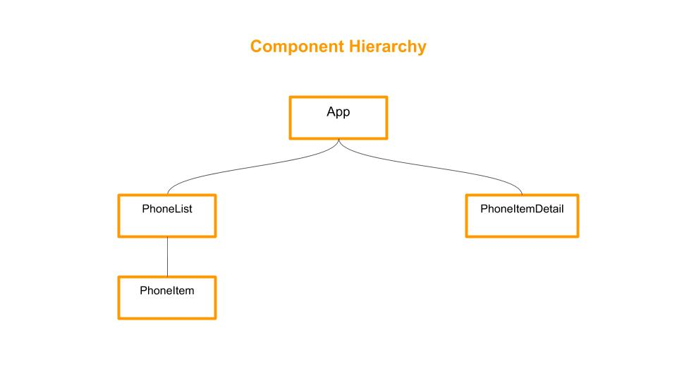

# GUIDESMITHS INTERVIEW CODE CHALLENGE 🎯

The challenge consists in creating a simple product catalogue app using:

- React Js
- Rest API
- Responsive Design

## Challenge Instructions :clipboard:

https://github.com/guidesmiths/interview-code-challenges/blob/master/react/phone-catalogue/instructions.md

## Installing :wrench:

1. Install Node.js
2. Download or clone the repository.
3. Install local dependencies with \$npm install.
4. Launch project with \$npm start.

## Component structure diagram ⚙

## Built With 🛠

- HTML5
- CSS3
  *Sass
  *CSS Grid
  \*Flexbox
- JavaScript
- React Js
- Git and Github

## Author

- **Cristina Pontijas** :octocat: [pontijas](https://github.com/pontijas)

Thanks for reading!
Have a nice day 🌞
